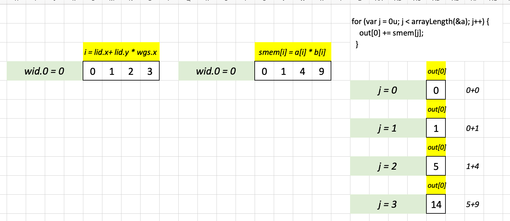

## Background

This file contains a walkthrough of my solutions for the WebGPU Puzzles. I have also created a walkthrough for the [official solutions]().

## Puzzle 1

```WGSL
@group(0) @binding(0) var<storage, read_write> a : array<f32>;
@group(0) @binding(1) var<storage, read_write> out : array<f32>;

@compute @workgroup_size({{workgroupSize}})
fn main(@builtin(local_invocation_id) lid: vec3<u32>) {
  out[lid.x] = a[lid.x] + 10;
}
```

```
Test case 1

Workgroup Size       ( 6, 1, 1 )
Total Workgroups     ( 1, 1, 1 )
Input a  [  0  1  2  3  4  5 ]

Expected [ 10 11 12 13 14 15 ]
___________________________________
Test case 2

Workgroup Size       ( 10, 1, 1 )
Total Workgroups     ( 1, 1, 1 )
Input a  [  0  1  2  3  4  5  6  7  8  9 ]

Expected [ 10 11 12 13 14 15 16 17 18 19 ]
```

For both test cases, `lid.x` sufficiently indexes into the input array `a` as it has 6 elements for Test case 1 and 10 elements for Test case 2.

## Puzzle 2

```WGSL
@group(0) @binding(0) var<storage, read_write> a : array<f32>;
@group(0) @binding(1) var<storage, read_write> b : array<f32>;
@group(0) @binding(2) var<storage, read_write> out : array<f32>;

@compute @workgroup_size({{workgroupSize}})
fn main(@builtin(local_invocation_id) lid: vec3<u32>) {

  out[lid.x] = a[lid.x] + b[lid.x]; 
  
}
```

```
Test case 1

Workgroup Size       ( 4, 1, 1 )
Total Workgroups     ( 1, 1, 1 )

Input a  [  0  1 ]
Input b  [  2  3 ]

Expected [  2  4 ]
___________________________________
Test case 2

Workgroup Size       ( 10, 1, 1 )
Total Workgroups     ( 1, 1, 1 )

Input a  [  0  1  2  3  4 ]
Input b  [  5  6  7  8  9 ]

Expected [  5  7  9 11 13 ]
```

Similar to Puzzle #1, `lid.x` is sufficient to index into each input array and perform a elementwise sum operation. 

## Puzzle 3

```WGSL
@group(0) @binding(0) var<storage, read_write> a : array<f32>;
@group(0) @binding(1) var<storage, read_write> out : array<f32>;

@compute @workgroup_size({{workgroupSize}})
fn main(@builtin(local_invocation_id) lid: vec3<u32>) {
  let len = arrayLength(&a);
  
  if (lid.x < len) {
    out[lid.x] = a[lid.x] + 10;
  }
}
```

```
Test case 1

Workgroup Size       ( 10, 1, 1 )
Total Workgroups     ( 1, 1, 1 )

Input a  [  0  1  2  3  4  5 ]

Expected [ 10 11 12 13 14 15 ]
___________________________________
Test case 2

Workgroup Size       ( 12, 1, 1 )
Total Workgroups     ( 1, 1, 1 )

Input a  [  0  1  2  3  4  5  6  7  8  9 ]

Expected [ 10 11 12 13 14 15 16 17 18 19 ]
```

This is pretty much the same as Puzzle #1 except with a guard (`if (lid.x < len)`) so that we don't index out of bounds into the input array `a`.

## Puzzle 4

```WGSL
@group(0) @binding(0) var<storage, read_write> a : array<f32>;
@group(0) @binding(1) var<storage, read_write> out : array<f32>;

// wgs is a vec3 containing workgroup size in x, y, z.
// the x component is wgs.x, y component is wgs.y, and z component
// is wgs.z

const wgs = vec3({{workgroupSize}});

@compute @workgroup_size({{workgroupSize}})
fn main(@builtin(local_invocation_id) lid: vec3<u32>) {
  let i = wgs.x; 
  out[lid.x] = a[lid.x] + 10;
  out[lid.x + wgs.x] = a[lid.x + wgs.x] + 10;
  out[lid.x + wgs.x + 1] = a[lid.x + wgs.x + 1] + 10;
}
```

```
Test case 1

Workgroup Size       ( 3, 3, 1 )
Total Workgroups     ( 1, 1, 1 )

Input a  [  0  1  2  3 ]

Expected [ 10 11 12 13 ]
___________________________________
Test case 2

Workgroup Size       ( 4, 4, 1 )
Total Workgroups     ( 1, 1, 1 )

Input a  [  0  1  2  3  4  5  6  7  8 ]

Expected [ 10 11 12 13 14 15 16 17 18 ]
```

This was a hacky solution as at this point in my WebGPU journey I had no idea how to utilize the workgroup size or invocation IDs to cleverly index into an array when the number of positions in the input was larger than the number of positions in lid.x or lid.y.

This line:

```WGSL
out[lid.x] = a[lid.x] + 10;
```

Only populates the first three elements of `out`.

The next line:

```WGSL
out[lid.x + wgs.x] = a[lid.x + wgs.x] + 10;
```

Populates up to 6 elements for Test case 1 (lid.x has three elements + workgroup size x = 3) which passes the test. Test case 2 has 9 elements and lid.x + wgs.x only goes up to 8 elements so I needed to add `1` to pass Test case 2:

```WGSL
out[lid.x + wgs.x + 1] = a[lid.x + wgs.x + 1] + 10;
```

Ugly solution but that's what I was able to do at that point.

## Puzzle 5

```WGSL
@group(0) @binding(0) var<storage, read_write> a : array<f32>;
@group(0) @binding(1) var<storage, read_write> b : array<f32>;
@group(0) @binding(2) var<storage, read_write> out : array<f32>;

// workgroup sizes: wgs.x, wgs.y, wgs.z 
const wgs = vec3({{workgroupSize}});

@compute @workgroup_size({{workgroupSize}})
fn main(@builtin(local_invocation_id) lid: vec3<u32>) {
  //out[lid.x] = a[lid.x];
  //out[lid.x + wgs.x] = b[lid.x] + 1;
  //out[lid.x + 2 * wgs.x] = b[lid.x] + 2;
  //out[lid.x + 3 * wgs.x] = b[lid.x] + 3;
  out[lid.x + lid.y * wgs.x] = a[lid.x] + b[lid.y];
}
```

```
Test case 1

Workgroup Size       ( 4, 4, 1 )
Total Workgroups     ( 1, 1, 1 )

Input a  [  0  1  2  3 ]
Input b  [  0  1  2  3 ]

Expected [  0  1  2  3  1  2  3  4  2  3  4  5  3  4  5  6 ]

___________________________________
Test case 2

Workgroup Size       ( 9, 9, 1 )
Total Workgroups     ( 1, 1, 1 )

Input a  [  0  1  2  3  4  5  6  7  8 ]
Input b  [  0  1  2  3  4  5  6  7  8 ]

Expected [  0  1  2  3  4  5  6  7  8  1  2  3  4  5  6  7  8  9  2  3  4  5  6  7 ... 10 11 12 13 14  7  8  9 10 11 12 13 14 15  8  9 10 11 12 13 14 15 16 ]
```

After reading the official solution to Puzzle #4, this was the first puzzle where I felt like I was actually utilizing workgroup size and location invocation IDs correctly. See the commented lines for how I built up this solution intuitively. The following screenshot shows how I visualized the indexing in Excel for Test case 1 before arriving at the final solution:


## Puzzle 6

```WGSL
@group(0) @binding(0) var<storage, read_write> a : array<f32>;
@group(0) @binding(1) var<storage, read_write> out : array<f32>;

const wgs = vec3({{workgroupSize}}); // workgroup sizes
const twg = vec3({{totalWorkgroups}}); // total workgroups

@compute @workgroup_size({{workgroupSize}})
fn main(@builtin(local_invocation_id) lid: vec3<u32>,
        @builtin(global_invocation_id) gid: vec3<u32>,
        @builtin(workgroup_id) wid: vec3<u32>) {
  let i = lid.x + wid.x * wgs.x; // Solution 1
  //let i = wid.x + lid.x * twg.x; //  Solution 2
  //let i = gid.x; // Solution 3
  if (i < arrayLength(&a)) {
    out[i] = a[i] + 10;
  }
  
}
```

```
Test case 1

Workgroup Size       ( 2, 1, 1 )
Total Workgroups     ( 3, 1, 1 )

Input a  [  0  1  2  3  4  5 ]

Expected [ 10 11 12 13 14 15 ]
___________________________________
Test case 2

Workgroup Size       ( 4, 1, 1 )
Total Workgroups     ( 3, 1, 1 )

Input a  [  0  1  2  3  4  5  6  7  8  9 ]

Expected [ 10 11 12 13 14 15 16 17 18 19 ]
```

I came up with three solutions for this one, as illustrated by the images below for Test case 1:


```WGSL
let i = lid.x + wid.x * wgs.x; // Solution 1
```


```WGSL
let i = wid.x + lid.x * twg.x; //  Solution 2
```


```WGSL
let i = gid.x; // Solution 3
```


## Puzzle 7

```WGSL
@group(0) @binding(0) var<storage, read_write> a : array<f32>;
@group(0) @binding(1) var<storage, read_write> out : array<f32>;

const wgs = vec3({{workgroupSize}}); // workgroup sizes
const twg = vec3({{totalWorkgroups}}); // total workgroups

@compute @workgroup_size({{workgroupSize}})
fn main(@builtin(local_invocation_id) lid: vec3<u32>,
        @builtin(global_invocation_id) gid: vec3<u32>,
        @builtin(workgroup_id) wid: vec3<u32>) {
  //let i = gid.x + gid.y * wgs.x * twg.x; // Solution 1
  let i = gid.y + gid.x * wgs.x * twg.x; // Solution 2
  if (i < arrayLength(&a)) {
    out[i] = a[i] + 10;
  }
  
}
```

```
Test case 1 

Workgroup Size       ( 2, 2, 1 )
Total Workgroups     ( 2, 2, 1 )

Input a  [  0  1  2  3  4  5  6  7  8 ]

Expected [ 10 11 12 13 14 15 16 17 18 ]

___________________________________
Test case 2 

Workgroup Size       ( 2, 2, 1 )
Total Workgroups     ( 3, 3, 1 )

Input a  [  0  1  2  3  4  5  6  7  8  9 10 11 12 13 14 15 16 17 18 19 20 21 22 23 24 ]

Expected [ 10 11 12 13 14 15 16 17 18 19 20 21 22 23 24 25 26 27 28 29 30 31 32 33 34 ]
```

I came up with 2 solutions for this one, as illustrated by the images below for Test case 2.

```WGSL
let i = gid.x + gid.y * wgs.x * twg.x; // Solution 1
```


```WGSL
let i = gid.y + gid.x * wgs.y * twg.y; // Solution 2
```


Solution 2 is basically Solution 1 transposed, since we're consistently adding `gid.y` to 6 times `gid.x`, instead of adding `gid.x` to 6 times `gid.y`.

Note that in both solutions above, `twg.x` can be replaced with `twg.y` and `wgs.x` can be replaced with `wgs.y` as these values are consistent in each Test case.

## Puzzle 8

I can't recall if I came up with my own solution, so I won't do the walkthrough here as it's the same as the [official solution]().

## Puzzle 9

```WGSL
@group(0) @binding(0) var<storage, read_write> a : array<f32>;
@group(0) @binding(1) var<storage, read_write> out : array<f32>;

const wgs = vec3({{workgroupSize}}); // workgroup sizes
const twg = vec3({{totalWorkgroups}}); // total workgroups
var<workgroup> smem: array<f32, {{smemSize}}>;

@compute @workgroup_size({{workgroupSize}})
fn main(@builtin(local_invocation_id) lid: vec3<u32>,
        @builtin(global_invocation_id) gid: vec3<u32>,
        @builtin(workgroup_id) wid: vec3<u32>) {
  if (gid.x < arrayLength(&a)) {
    smem[lid.x] = a[gid.x];
  }
  workgroupBarrier();
  
  if (gid.x < 2) {
    out[gid.x] = smem[gid.x];
  } else {
    out[gid.x] = smem[gid.x - 2] + smem[gid.x - 1] + smem[gid.x];
  }
}
```

```
Test case 1

Workgroup Size       ( 8, 1, 1 )
Total Workgroups     ( 1, 1, 1 )
Shared Memory  Size  ( 8, 1, 1 )

Input a  [  0  1  2  3  4  5  6  7 ]

Expected [  0  1  3  6  9 12 15 18 ]
___________________________________
Test case 2

Workgroup Size       ( 10, 1, 1 )
Total Workgroups     ( 1, 1, 1 )
Shared Memory  Size  ( 10, 1, 1 )

Input a  [  0  1  2  3  4  5  6  7  8  9 ]

Expected [  0  1  3  6  9 12 15 18 21 24 ]
```

Here's how I visualized my solution in Excel:


## Puzzle 10

```WGSL
@group(0) @binding(0) var<storage, read_write> a : array<f32>;
@group(0) @binding(1) var<storage, read_write> b : array<f32>;
@group(0) @binding(2) var<storage, read_write> out : array<f32>;

const wgs = vec3({{workgroupSize}});
const twg = vec3({{totalWorkgroups}});
var<workgroup> smem: array<f32, {{smemSize}}>;

@compute @workgroup_size({{workgroupSize}})
fn  main(@builtin(local_invocation_id) lid: vec3<u32>,
         @builtin(global_invocation_id) gid: vec3<u32>) {
  let i = lid.x + lid.y * wgs.x;
  if (i < arrayLength(&a)) {
    smem[i] = a[i] * b[i];
  }
  workgroupBarrier();
  
  for (var j = 0u; j < arrayLength(&a); j++){
    out[0] += smem[j];
  }
}
```

```
Test case 1

Workgroup Size       ( 4, 1, 1 )
Total Workgroups     ( 1, 1, 1 )
Shared Memory  Size  ( 4, 1, 1 )

Input a  [  0  1  2  3 ]
Input b  [  0  1  2  3 ]

Expected [ 14 ]
___________________________________
Test case 2

Workgroup Size       ( 5, 1, 1 )
Total Workgroups     ( 1, 1, 1 )
Shared Memory  Size  ( 5, 1, 1 )

Input a  [  0  1  2  3  4 ]
Input b  [  0  1  2  3  4 ]

Expected [ 30 ]
```

I wasn't sure what the WGSL-correct way to approach this was so I asked Claude and it gave me most of my solution, all I did was to incorporate shared memory:


The following line loads into shared memory the elementwise product of input arrays `a` and `b` (Test case 1):

```WGSL
smem[i] = a[i] * b[i];
```

Then, this for-loop performs a cumulative sum of the shared memory array:

```WGSL
for (var j = 0u; j < arrayLength(&a); j++){
    out[0] += smem[j];
  }
```

Here was how I visualized my solution in Excel:



## Puzzle 11

```WGSL
@group(0) @binding(0) var<storage, read_write> a : array<f32>;
@group(0) @binding(1) var<storage, read_write> b : array<f32>;
@group(0) @binding(2) var<storage, read_write> out : array<f32>;

const wgs = vec3({{workgroupSize}});
const twg = vec3({{totalWorkgroups}});

var<workgroup> smemA: array<f32, wgs.x * wgs.y * wgs.z + 4>;
var<workgroup> smemB: array<f32, 4>;

@compute @workgroup_size({{workgroupSize}})
fn  main(@builtin(local_invocation_id) lid: vec3<u32>,
         @builtin(global_invocation_id) gid: vec3<u32>) {
  for (var i = 0u; i < arrayLength(&a); i++){
    // element-wise multiplication between
    // four elements of a and b
    for (var k = 0u; k < 4; k++){
      if (k + i >= arrayLength(&a)){
        smemB[k] = 0;
      } else {
        smemB[k] = a[k + i] * b[k];
      }
  
      // dot product = convolution
      out[i] += smemB[k];
    }
 }
}
```


```
Test case 1

Workgroup Size       ( 8, 1, 1 )
Total Workgroups     ( 2, 1, 1 )
Shared Memory  Size  ( 12, 1, 1 )

Expected [ 14 20 26 32 38 44 50 56 62 68 74 80 41 14  0 ]
___________________________________
Test case 2

Workgroup Size       ( 8, 1, 1 )
Total Workgroups     ( 3, 1, 1 )
Shared Memory  Size  ( 12, 1, 1 )

Expected [ 14 20 26 32 38 44 50 56 62 68 74 80 86 92 98 50 17  0 ]
```

`b` is the convolution kernel and `a` is being convolved. My approach was to perform a dot-product between `b` (which is fixed) and a sliding window of `a` (capturing the next 4 elements each loop iteration). If the sliding 4-element window of `a` goes beyond its length, the out-of-bounds element should be `0`.

The following logic loads the dot product between `b` and the sliding window of `a` into shared memory:

```WGSL
if (k + i >= arrayLength(&a)){
    smemB[k] = 0;
} else {
    smemB[k] = a[k + i] * b[k];
}
```

In hindsight, I should have loaded `a` into shared memory `smemA` to make this operation quicker.

Here is the visualization of the convolution between `b` and the first four sliding windows of `a`:


Here is a visualization example of situations where `k + i` is greater than the length of the input `a` (which it will be for the last three dot-products).


## Puzzle 12

```WGSL
@group(0) @binding(0) var<storage, read_write> a : array<f32>;
@group(0) @binding(1) var<storage, read_write> out : array<f32>;

const wgs = vec3({{workgroupSize}});
const twg = vec3({{totalWorkgroups}});
var<workgroup> smem: array<f32, {{smemSize}}>;

@compute @workgroup_size({{workgroupSize}})
fn main(@builtin(local_invocation_id) lid: vec3<u32>,
        @builtin(global_invocation_id) gid: vec3<u32>,
        @builtin(workgroup_id) wid: vec3<u32>) {
  smem[lid.x] = a[gid.x];
  workgroupBarrier();
  
  var sum: f32 = 0.0;
  let elementsLeft = arrayLength(&a) - wid.x * wgs.x;
  for (var i = 0u; i < wgs.x; i = i + 1) {
      if (i < elementsLeft) {
        sum = sum + smem[i];
      }
  }
  
  out[wid.x] = sum;
}
```

```
Test case 1

Workgroup Size       ( 8, 1, 1 )
Total Workgroups     ( 1, 1, 1 )
Shared Memory  Size  ( 8, 1, 1 )

Input a  [  0  1  2  3  4  5  6  7 ]

Expected [ 28 ]
___________________________________
Test case 2

Workgroup Size       ( 8, 1, 1 )
Total Workgroups     ( 2, 1, 1 )
Shared Memory  Size  ( 8, 1, 1 )

Input a  [  0  1  2  3  4  5  6  7  8  9 ]

Expected [ 28 17 ]
```

The key insight I gained from this puzzle was from the following line:

```WGSL
out[wid.x] = sum;
```

This is utilizing the parallelism of workgroups: they operate (from what I understand) in isolation. So what happens in the workgroup, stays in the workgroup.

The next thing I want to highlight is how I ensure that my loop index does not go out-of-bounds, with the following lines:

```WGSL
let elementsLeft = arrayLength(&a) - wid.x * wgs.x;

...

if (i < elementsLeft) {
    sum = sum + smem[i];
}
```

For Test case 1:

`elementsLeft` = `8` - `0` * `8` = `8`.

For Test case 2:

`wid.x = 0`:

`elementsLeft` = `10` - `0` * `8` = `8`.

`wid.x = 1`:

`elementsLeft` = `10` - `1` * `8` = `2`.

## Puzzle 13

```WGSL
@group(0) @binding(0) var<storage, read_write> a : array<f32>;
@group(0) @binding(1) var<storage, read_write> out : array<f32>;

const wgs = vec3({{workgroupSize}});
const twg = vec3({{totalWorkgroups}});
var<workgroup> smem: array<f32, {{smemSize}}>;

@compute @workgroup_size({{workgroupSize}})
fn main(@builtin(local_invocation_id) lid: vec3<u32>,
        @builtin(global_invocation_id) gid: vec3<u32>,
        @builtin(workgroup_id) wid: vec3<u32>) {

    var sum: f32 = 0.0;
    let cols = arrayLength(&a) / twg.y;
    let rowIdx = wid.y * cols;

    if (lid.x < cols) {
        smem[lid.x] = a[rowIdx + lid.x];
    }

    workgroupBarrier();

    for (var i: u32 = 0; i < cols; i = i + 1) {
        sum = sum + smem[i];
    }

    out[wid.y] = sum;
}
```

```
Test case 1

Workgroup Size       ( 8, 1, 1 )
Total Workgroups     ( 1, 4, 1 )
Shared Memory  Size  ( 8, 1, 1 )

Input a  
        0    1    2    3    4    5  
        6    7    8    9   10   11  
       12   13   14   15   16   17  
       18   19   20   21   22   23

Expected [ 15 51 87 123 ]
___________________________________
Test case 2

Workgroup Size       ( 8, 1, 1 )
Total Workgroups     ( 1, 4, 1 )
Shared Memory  Size  ( 8, 1, 1 )

Input a  
        0    1    2    3  
        4    5    6    7  
        8    9   10   11  
       12   13   14   15

Expected [  6 22 38 54 ]
```

This was the first puzzle where I implemented multiple GPU-concepts on my own (without looking at the official solution!).

For Test case 1:

I define the number of "columns" in the input array `a`, which is `24 / 4 = 6`

```WGSL
let cols = arrayLength(&a) / twg.y;
```

I then define a row index which will be used to calculate the sum of each row:

```WGSL
let rowIdx = wid.y * cols;
```

Here's a visualization in Excel of what `rowIdx` is for each workgroup:


I then utilize `rowIdx` when loading the corresponding "row" of `a` into shared memory:


The final bit of my solution loops through each of the six elements in the array and performs a cumulative sum:

```WGSL
for (var i: u32 = 0; i < cols; i = i + 1) {
    sum = sum + smem[i];
}
```

I think it's so cool how each workgroup does its own loop on its own shared memory values to yield its own row sum. I don't know enough yet about how GPU kernels work but I would imagine there's something happening behind the scenes in `gpu.cpp` that orchestrates all of this.

## Puzzle 14

I came up with three different solutions, one for Test case 1 and 3, one for Test case 2, and one for Test case 4 and 5.

The following code passes Test cases 1 and 3:

```WGSL
@group(0) @binding(0) var<storage, read_write> a: array<f32>;
@group(0) @binding(1) var<storage, read_write> b: array<f32>;
@group(0) @binding(2) var<storage, read_write> output: array<f32>;

const wgs = vec3({{workgroupSize}});
const twg = vec3({{totalWorkgroups}});
const tileSize = vec3({{workgroupSize}});
var<workgroup> a_shared: array<f32, 256>;
var<workgroup> b_shared: array<f32, 256>;

@compute @workgroup_size({{workgroupSize}})
fn main(
  @builtin(local_invocation_id) lid: vec3<u32>,
  @builtin(global_invocation_id) gid: vec3<u32>,
  @builtin(workgroup_id) wid: vec3<u32>) {
  if ((wgs.x == 3) | (wgs.x == 4)){
    let length = arrayLength(&a);
    let square_dim = u32(sqrt(f32(length)));
    let idx = lid.y * square_dim + lid.x;
    let idx2 = lid.x * square_dim + lid.y;
    if ((lid.y < square_dim) & (lid.x < square_dim)) {
        
        a_shared[idx] = a[idx];
        b_shared[idx2] = b[idx];
        
        var count = 0u;
        for (var i = 0u; i < square_dim; i++) {
            for (var j = 0u; j < square_dim; j++) {
                for (var k = 0u; k < square_dim; k++) {
                    output[count] = output[count] + a_shared[i*square_dim+k] * b_shared[j*square_dim+k];
                }
              count = count + 1;
            }
        }
      
    }
  }
}
```

I visualized the `idx` and `idx2` (basically the tranpose of `idx`) indexes for Test case 1 and 3 in Excel:


Since there is only workgroup in Test case 1 and 3, I figured I would just load each input array into its corresponding shared memory array and then perform a 3-loop matrix multiplication.

The following code passes Test cases 2:

```WGSL
@group(0) @binding(0) var<storage, read_write> a: array<f32>;
@group(0) @binding(1) var<storage, read_write> b: array<f32>;
@group(0) @binding(2) var<storage, read_write> output: array<f32>;

const wgs = vec3({{workgroupSize}});
const twg = vec3({{totalWorkgroups}});
const tileSize = vec3({{workgroupSize}});
var<workgroup> a_shared: array<f32, {{smemSize}}>;
var<workgroup> b_shared: array<f32, {{smemSize}}>;

@compute @workgroup_size({{workgroupSize}})
fn main(
  @builtin(local_invocation_id) lid: vec3<u32>,
  @builtin(global_invocation_id) gid: vec3<u32>,
  @builtin(workgroup_id) wid: vec3<u32>) {
  
  if (wgs.x == 1) {
  
    let length = arrayLength(&a);
    let square_dim = u32(sqrt(f32(length)));
    let idx = wid.y * square_dim + wid.x;

    for (var i = 0u; i < square_dim; i++){
        a_shared[i] = a[wid.y * square_dim + i];
    }

    for (var j = 0u; j < square_dim; j++){
        b_shared[j] = b[wid.x + j * square_dim];
    }

    for (var k = 0u; k < square_dim; k++){
        output[idx] = output[idx] + a_shared[k] * b_shared[k];
    }

  }
}
```

I visualized the `idx` index for Test case 2 in Excel:


Test Case 2 was unique: it had only 1 thread per workgroup. Each of the 4 workgroups would be responsible for one dot-product between the 2x2 inputs `a` and `b`. To achieve this, I utilized `wid.x` and `wid.y` when loading data into shared memory. This was a conceptual breakthrough for me.

And finally, the following code passes Test cases 4 and 5:

```WGSL
@group(0) @binding(0) var<storage, read_write> a: array<f32>;
@group(0) @binding(1) var<storage, read_write> b: array<f32>;
@group(0) @binding(2) var<storage, read_write> output: array<f32>;

const wgs = vec3({{workgroupSize}});
const twg = vec3({{totalWorkgroups}});
const tileSize = vec3({{workgroupSize}});
var<workgroup> a_shared: array<f32, 256>;
var<workgroup> b_shared: array<f32, 256>;

@compute @workgroup_size({{workgroupSize}})
fn main(
  @builtin(local_invocation_id) lid: vec3<u32>,
  @builtin(global_invocation_id) gid: vec3<u32>,
  @builtin(workgroup_id) wid: vec3<u32>) {
  
  if (wgs.x == 2) {
    let wg = wid.x + wid.y * twg.x;
    let length = arrayLength(&a);
    let square_dim = u32(sqrt(f32(length)));
    let i = lid.x + lid.y * wgs.x + square_dim * wg;
  
    if ((i < length) & (i < (wg + 1) * square_dim)) {
      a_shared[lid.x + lid.y * wgs.x] = a[i];
    
      for (var k = 0u; k < square_dim; k++){
        output[i] = output[i] + a_shared[k] * b[(i % square_dim) + k * square_dim];
      }
    }
  }
  
}
```

I visualized the `wg` and `i` indexes for Test cases 4 and 5 in Excel:


I heavily relied on the official solution to Puzzle #7 which used the following indexing approach, in which the `wg` index assigns unique consecutive integer IDs to workgroup and `i` assigns unique consecutive integer IDs to each thread across workgroups:


In my solution for Test cases 4 and 5, all threads in each workgroup use the same row of `a` in its dot products so I load that row into the workgroup's shared memory with:

```WGSL
a_shared[lid.x + lid.y * wgs.x] = a[i];
```

I realized this after sketching out the matrix multiplication by hand.

A bit more on Test case 4 and 5: each thread uses a different column of `b` so I couldn't figure out a way to utilize `b_shared` memory. Instead, I used the modulo operator to index the correct column from `b` with:

```WGSL
b[(i % square_dim) + k * square_dim]
```

Where `k` is the loop index.

```
Test case 1

Workgroup Size       ( 3, 3, 1 )
Total Workgroups     ( 1, 1, 1 )
Shared Memory  Size  ( 3, 3, 1 )

Input a  
        0    1  
        2    3

Input b  
        0    1  
        2    3

Expected 
        2    3  
        6   11
___________________________________
Test case 2 

Workgroup Size       ( 1, 1, 1 )
Total Workgroups     ( 2, 2, 1 )
Shared Memory  Size  ( 3, 3, 1 )

Input a  
        0    1  
        2    3

Input b  
        0    1  
        2    3


Expected 
        2    3  
        6   11
___________________________________
Test case 3 

Workgroup Size       ( 4, 4, 1 )
Total Workgroups     ( 1, 1, 1 )
Shared Memory  Size  ( 4, 4, 1 )

Input a  
        0    1    2  
        3    4    5  
        6    7    8

Input b  
        9   10   11  
       12   13   14  
       15   16   17

Expected 
       42   45   48  
      150  162  174  
      258  279  300
___________________________________
Test case 4 

Workgroup Size       ( 2, 2, 1 )
Total Workgroups     ( 2, 2, 1 )
Shared Memory  Size  ( 2, 2, 1 )

Input a  
        0    1    2  
        3    4    5  
        6    7    8

Input b  
        9   10   11  
       12   13   14  
       15   16   17

Expected 
       42   45   48  
      150  162  174  
      258  279  300
___________________________________
Test case 5

Workgroup Size       ( 2, 2, 1 )
Total Workgroups     ( 2, 2, 1 )
Shared Memory  Size  ( 2, 2, 1 )

Input a  
        0    1    2    3  
        4    5    6    7  
        8    9   10   11  
       12   13   14   15

Input b  
        0    1    2    3  
        4    5    6    7  
        8    9   10   11  
       12   13   14   15

Expected 
       56   62   68   74  
      152  174  196  218  
      248  286  324  362  
      344  398  452  506
```

